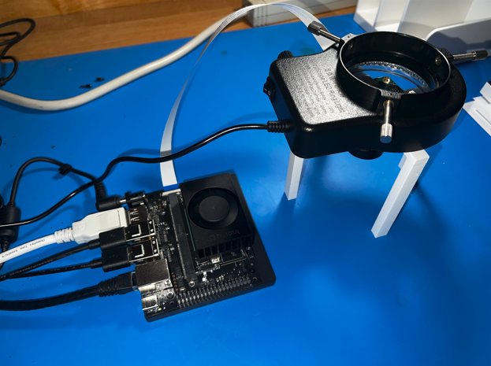

# About The Project

This project aimed to develop and implement an Optical Character Recognition (OCR) system by leveraging the capabilities of the NVIDIA Jetson Orin Nano Development Platform. The original objective was to create a functional OCR application capable of accurately recognizing and identifying single characters from a live video feed. The project's scope was then expanded to handle multiple characters and eventually full words and sentences. The vision is to harness the power of advanced neural networks and embedded GPU technology to deliver a robust, real-time OCR solution suitable for various real-world applications.

The educational goal of this project was to learn and understand the low-level implementation and functionality of neural networks. Therefore, all major functionalities for performing character inference were written from scratch, avoiding the use of common Python and C/C++ libraries.

To view the full project proposal and see a greater breakdown of the project timeline, please refer to documentation here: [Project Proposal](https://github.com/tonygonzalez14/jetson-ocr/blob/main/assets/Antonio_Gonzalez_Project_Proposal_Final.pdf)

To view program demonstration see the `assets` folder or click here: [Program Demo](https://github.com/tonygonzalez14/jetson-ocr/blob/main/assets/A2e%20OCR%20Program%20Demo.mp4)

This project was done in collaboration with [A2e Technologies](https://www.a2etechnologies.com/) under their Summer Internship Program.

---
# Getting Started

## Software Prerequisites
The following software and libraries should be installed before attempting to run the program or install any drivers:
* **C++ Compiler**: Version 9.4 or later (e.g., GCC, Clang)
* **CUDA**: Version 11.4 or later
* **OpenCV**: Version 4.8 or later
* **Python**: Version 3.8 or later
* **NumPy**: Version 1.17 or later
* **Git**: Version 2.25 or later

### Python Dependencies
To install the Python dependencies required for this project, follow these steps:

1. **Ensure Python is Installed**: Verify that Python 3.8 or later is installed by running `python --version` or `python3 --version` in your terminal.

2. **Create and Activate a Virtual Environment (Recommended)**:
   - **Linux**:
     ```bash
     python3 -m venv venv
     source venv/bin/activate
     ```

3. **Install the Required Python Packages**:
   - Ensure you are in the project directory where the `requirements.txt` file is located.
   - Run the following command to install all required packages:
     ```bash
     pip install -r requirements.txt
     ```

4. **Verify Installation**:
   - You can check if the packages were installed correctly by running:
     ```bash
     pip list
     ```
   - This will list all installed packages and their versions.

For detailed instructions on how to use the `requirements.txt` file, see [Python's documentation on virtual environments](https://docs.python.org/3/library/venv.html) and [pip's user guide](https://pip.pypa.io/en/stable/user_guide/).

## Hardware Requirements
*This system is intended to be run on the NVIDIA Jetson Development Kits* connected with a CSI Camera. The following hardware was used in the development of this system:
* [NVIDIA Jetson Orin Nano Development Kit](https://www.amazon.com/NVIDIA-Jetson-Orin-Nano-Developer/dp/B0BZJTQ5YP?th=1)
	* __Running JetPack 5.1.1/L4T 35.3.1 or JetPack 5.1.2/L4T 35.4.1__
* [ArduCam 12MP IMX477 CSI Camera](https://www.amazon.com/Arducam-Vision-Automatic-Switching-All-Day/dp/B08PFJDJC9/ref=asc_df_B08PFJDJC9/?tag=hyprod-20&linkCode=df0&hvadid=692875362841&hvpos=&hvnetw=g&hvrand=4089370263407136179&hvpone=&hvptwo=&hvqmt=&hvdev=c&hvdvcmdl=&hvlocint=&hvlocphy=9031352&hvtargid=pla-2281435177858&psc=1&mcid=592ef88e093535078f3a5876959ac6c4&hvocijid=4089370263407136179-B08PFJDJC9-&hvexpln=73&gad_source=1)
* microSD card (64GB UHS-1 or larger)
* USB keyboard and mouse
* Computer display
* DisplayPort or HDMI cable
* Internet connection (wired or wireless)
* [USB LED Ring Light](https://www.amazon.com/dp/B0B1JQLXG7/?coliid=I2CL7K6SF1OJ6R&colid=25019283DLIGS&ref_=list_c_wl_lv_ov_lig_dp_it&th=1)

If flashing via SDK Manager:
* Native Linux PC
* USB 3 to USB C _or_ USB C to USB C cable
	* Depending on the available ports on your Linux PC

---
# Hardware Setup

### NVIDIA Jetson 
If it is your first time setting up your NVIDIA Jetson, it is recommended to flash the Jetson using [SDK Manager](https://developer.nvidia.com/sdk-manager ).
* Refer to this YouTube tutorial from JetsonHacks for detailed instructions: [NVIDIA SDK Manager Tutorial: Installing Jetson Software Explained](https://www.youtube.com/watch?v=Ucg5Zqm9ZMk)
* [NVIDIA SDK Manager Documentation](https://docs.nvidia.com/sdk-manager/)

If SDK manager is not an option or you prefer a simpler method, you may also flash your Jetson via microSD card. 
* Refer to this tutorial for detailed instructions for Windows, Mac, and Linux: [Jetson Orin Nano Developer Kit Getting Started Guide](https://developer.nvidia.com/embedded/learn/get-started-jetson-orin-nano-devkit#intro)
###### Disclaimer: 
Flashing the Jetson via [SDK Manager](https://developer.nvidia.com/sdk-manager ) will _require_ a native Linux PC running __Ubuntu 18.04 or 20.04__. Using a VM to run Ubuntu and attempting to use SDK Manager will not work. 

### ArduCam
Use of the [ArduCam 12MP IMX477 CSI Camera](https://www.amazon.com/Arducam-Vision-Automatic-Switching-All-Day/dp/B08PFJDJC9/ref=asc_df_B08PFJDJC9/?tag=hyprod-20&linkCode=df0&hvadid=692875362841&hvpos=&hvnetw=g&hvrand=4089370263407136179&hvpone=&hvptwo=&hvqmt=&hvdev=c&hvdvcmdl=&hvlocint=&hvlocphy=9031352&hvtargid=pla-2281435177858&psc=1&mcid=592ef88e093535078f3a5876959ac6c4&hvocijid=4089370263407136179-B08PFJDJC9-&hvexpln=73&gad_source=1) will require the installation of the appropriate drivers for your JetPack Version. Refer to the following guide for how to connect your ArduCam to your Jetson via the CSI connection ports: [ArduCam Quick-Start-Guide](https://docs.arducam.com/Nvidia-Jetson-Camera/Native-Camera/Quick-Start-Guide/)

1. **Download the bash scripts:**
```bash
cd ~
wget https://github.com/ArduCAM/MIPI_Camera/releases/download/v0.0.3/install_full.sh
```

2. **Install the driver and reboot system:**
```bash
chmod +x install_full.sh
./install_full.sh -m imx477
```

3. **Verify your driver installation:**
```bash
dmesg | grep -E "imx477|imx219|arducam"
```

The result shown means the driver was installed successfully:
```
[    0.000000] Linux version 5.10.120-tegra (arducam_006@arducam-server-006) (aarch64-linux-gcc.br_real (Buildroot 2020.08) 9.3.0, GNU ld (GNU Binutils) 2.33.1) #1 SMP PREEMPT Wed Aug 9 15:29:32 CST 2023
[    0.002899] DTS File Name: /home/arducam_006/jenkins/workspace/n_nano_kernel_l4t-35.4.1-arducam/kernel/kernel-5.10/arch/arm64/boot/dts/../../../../../../hardware/nvidia/platform/t23x/p3768/kernel-dts/tegra234-p3767-0003-p3768-0000-a0.dts
[   17.415135] nv_imx477: no symbol version for module_layout
[   17.423536] nv_imx477: loading out-of-tree module taints kernel.
[   17.423704] nv_imx477: loading out-of-tree module taints kernel.
[   17.442589] imx477 9-001a: tegracam sensor driver:imx477_v2.0.6
[   17.746012] imx477 9-001a: imx477_board_setup: error during i2c read probe (-121)
[   17.758240] imx477 9-001a: board setup failed
[   17.770853] imx477: probe of 9-001a failed with error -121
[   17.778801] imx477 10-001a: tegracam sensor driver:imx477_v2.0.6
[   18.080380] tegra-camrtc-capture-vi tegra-capture-vi: subdev imx477 10-001a bound
```

4. **Check cable connection:**
```bash
ls /dev/video*
```

The result shown means the cable connection is correct:
```
/dev/video0 or /dev/video1 
```

5. **Test the video feed:**
```bash
gst-launch-1.0 nvarguscamerasrc ! 'video/x-raw(memory:NVMM), width=(int)1920, height=(int)1080, format=(string)NV12, framerate=(fraction)60/1' ! nvvidconv ! xvimagesink -e
```

If you can see the live video feed from your camera, you are ready to start using the program.
###### Disclaimer:
JetPack 5.1.1/L4T 35.3.1 or JetPack 5.1.2/L4T 35.4.1 is required on the Jetson device in order for the driver to download successfully.

### Camera Stand
Locate and download the 3D modeled camera stand's `.stl` file from the `camera_stand` directory. Use a slicing software of your choice and generate G-code for the print. Prepare the filament of your choice and start print, PLA was used for this project.

## Assembling the System
1. Connect the [ArduCam 12MP IMX477 CSI Camera](https://www.amazon.com/Arducam-Vision-Automatic-Switching-All-Day/dp/B08PFJDJC9/ref=asc_df_B08PFJDJC9/?tag=hyprod-20&linkCode=df0&hvadid=692875362841&hvpos=&hvnetw=g&hvrand=4089370263407136179&hvpone=&hvptwo=&hvqmt=&hvdev=c&hvdvcmdl=&hvlocint=&hvlocphy=9031352&hvtargid=pla-2281435177858&psc=1&mcid=592ef88e093535078f3a5876959ac6c4&hvocijid=4089370263407136179-B08PFJDJC9-&hvexpln=73&gad_source=1) to the Jetson
	1. Locate the camera connector (CSI). It’s on the side of the carrier board, opposite to the GPIO pins
	2. Pull up on the plastic edges of the camera port. Do it gently to avoid pulling it off
	3. Push in the camera ribbon. Make sure the contacts are facing the heatsinks. Do not bend the flex cable, and make sure it’s firmly inserted into the bottom of the connector
2. *First* connect the mouse, keyboard, display, and ethernet (optional), to the Jetson *then*, connect the Jetson's DC Barrel Jack power supply
3. Insert the camera into the 3D printed camera stand in the orientation that matches the stand's keyed pattern
	1. The camera should sit flush on the top of the stand with only the backside of the PCB exposed
4. Plug in the [USB LED Ring Light](https://www.amazon.com/dp/B0B1JQLXG7/?coliid=I2CL7K6SF1OJ6R&colid=25019283DLIGS&ref_=list_c_wl_lv_ov_lig_dp_it&th=1) and place on top of the camera stand

The assembled system should look similar to the image below:



---
# Folder Hierarchy

At the highest level, the folders are split between the source code `code` and the training data `data`. Typically, only source code would be checked into the repo, but for the scope of this project, we decided to stray from the standard convention and included the train data images for those who may want to train the model on their own and recreate our results. A pre-trained model is also included in this repo.

* ## assets
	* Contains additional content such as images and videos 
* ## code
	* All source code for the project
	* ### deprecated
		* Old code that was used in the development of the final product but is no longer is use
	* ### inference
		* The main application can be found under the inference folder. This includes the CUDA inference file, OpenCV Python script, default config file, and Makefile
	* ### model
		* Contains files relating to the model
		* #### model-training
			* TensorFlow file used for training the model
		* #### trained-model
			* Pre-trained weight and bias CSV files for the neural network
	* ### utilities
		* Additional utility Python scripts
* ## data
	* Images used to train the model (40px x 60px). Training data contains alphanumeric English characters (62 classes). Uses 3475 font styles available in Google Fonts
	* The images are compressed in a zip folder and must be extracted before use. See [README - Data](https://github.com/tonygonzalez14/jetson-ocr/tree/main/data)
	* Dataset link: [OCR-Dataset](https://www.kaggle.com/datasets/harieh/ocr-dataset)

---
# Installation

## Building the Code
##### Clone the repo
Use your tool of choice to clone the repository. For example, using Git Bash:
```bash
git clone https://jira.a2etechnologies.com:8444/scm/aeocr/jetson-ocr.git
```
##### Build the Shared Object File
The main control flow of this system is managed by a Python program that uses OpenCV to handle the live video stream, detect character objects, produce overlays, and interface with the CUDA Inference API. This program uses the CTypes library to facilitate communication and efficient data transfer between the Python controller and the GPU-accelerated neural network.

Next, navigate into the inference directory:
```bash
cd jetson-ocr/code/inference
```

Finally, build the project:
```bash
make
```

If built successfully, a file called `libcuda_inference.so` should be created, at which point, you are ready to run the program. 

---
# Usage

### Test Page
A test page with 11pt Arial font should be used. Individual characters and/or separate words should have at least a tab's worth of space in between to avoid being represented as a whole word. Individual characters of a word should have exactly 1 space in-between each other to be considered part of the same word so that the program can properly detect individual characters. Characters/words should be at least double spaced apart to be detected on separate lines.

**An example test page can be found in the `assets` folder. Or click [Here](https://github.com/tonygonzalez14/jetson-ocr/blob/main/assets/Example%20OCR%20Test%20Page.docx)**
### Running the System
Navigate to the inference folder.
```bash
cd jetson-ocr/code/inference
```

The system is designed to be run from the command line with no additional arguments required. Although, command line arguments are available for further customization and testing purposes. For the full list of arguments use the -h, --help argument:
```
Character recognition using CUDA

Usage: perform_inference.py [-h] [-n NUMBER] [-v] [-c CONFIG]
	Press the "Esc" key to gracefully exit the program.

Options:  
	-h | --help           Print this message  
	-n | --number         Set maximum number of characters to process. Number must be greater than 0 and no more than 30. Default number is 30  
	-v | --verbose       Display FPS, inference time, number of images detected, and other info  
	-c | --config         Path to the config JSON file
```

Example:
```
	python3 perform_inference -n 25 -v     Inference on a maximum of 25 characters and include info like FPS, inference time, and number of images detected.

	python3 perform_inference -c new_config.json     Inference on a maximum of 20 characters (default) using the user-created "new_config.json", without displaying addtional infernce information. 
```
**Note:** Press the "Esc" key to gracefully exit the program.

The GUI should appear with the following elements:
* The viewing window showing the live video stream
* Detected objects encapsulated by a green bounding box 
* Detected character and percent certainty overlaid above the detected object

If the "verbose" option was chosen, in the top left of the window:
* Frames Per Second
* Max # of objects
* Detected # of objects
* Inference time

### Output Products
An output log `program.log` should be created once the program concludes that includes a report of key system operations with respective timestamps for debugging purposes or if unexpected errors are encountered. 

---
# Acknowledgements

Lastly, I would like to recognize the resources that helped in the development of this system:
* [A2e Technologies](https://www.a2etechnologies.com/)
* [Jetson Orin Nano Developer Kit Getting Started Guide](https://developer.nvidia.com/embedded/learn/get-started-jetson-orin-nano-devkit#intro)
* [NVIDIA SDK Manager Tutorial: Installing Jetson Software Explained](https://www.youtube.com/watch?v=Ucg5Zqm9ZMk)
* [NVIDIA SDK Manager Documentation](https://docs.nvidia.com/sdk-manager/)
* [ArduCam Quick-Start-Guide](https://docs.arducam.com/Nvidia-Jetson-Camera/Native-Camera/Quick-Start-Guide/)
* [CUDA C++ Programming Guide](https://docs.nvidia.com/cuda/cuda-c-programming-guide/index.html)
* [PNG Encoder and Decoder in C and C++](https://github.com/lvandeve/lodepng)
* [Contrast Stretching Background Info](https://homepages.inf.ed.ac.uk/rbf/HIPR2/stretch.htm)
* [YouTube NVIDIA Jetson Tutorials](https://www.youtube.com/@JetsonHacks)
* [CUDA Basics Course](https://www.youtube.com/playlist?list=PLC6u37oFvF40BAm7gwVP7uDdzmW83yHPe)
* [Neural Network Basics Course](https://www.youtube.com/playlist?list=PLZHQObOWTQDNU6R1_67000Dx_ZCJB-3pi)

